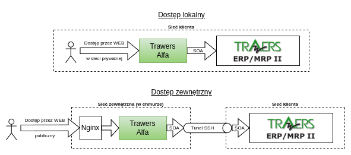
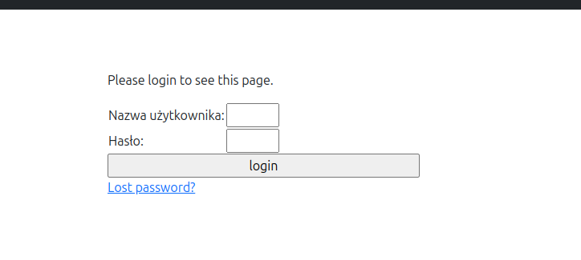
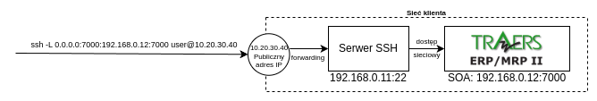

# Trawers 7 ERP Cloud (Alfa)

**Tawers 7 ERP Cloud (zwany dalej  Alfa)** to nowy produkt z rodziny Trawers umożliwiający interakcję z usługami Trawersa ERP z chmury bądź sieci lokalnej poprzez interfejs WEBowy:


<p align="center">
  
</p>

W przypadku dostępu lokalnego, **Alfa** łączy się z usługami Trawersa bezpośrednio poprzez interfejs SOA. Do dostępu z zewnątrz możliwa jest konfiguracja tunelu SSH. Dzięki udostępnieniu Alfy publicznie możemy uzyskać dostęp do usług Trawers z dowolnego miejsca.

Niniejsza dokumentacja opisuje proces przykładowej instalacji Alfy na serwerach utrzymywanych przez klienta (w chwili obecnej nie jest to rozwiązanie Software-as-a-Service).

**UWAGA**: Ta dokumentacja przedstawia jedynie przykładowy sposób instalacji Alfy a nie kompletną procedurę produkcyjną. Ma ona służyć za pomocniczą referencję dla klienta. Firma Tres nie ponosi odpowiedzialności za infrastrukturę ani bezpieczeństwo połączeń sieciowych. Alfa jest produktem aktywnie rozwijanym i proponowane rozwiązania mogą ulec zmianie.

#### Spis treści
1. [Demo](#demo)
2. [Komponenty](#komponenty)
3. [Konfiguracja Trawers ERP](#konfiguracja-trawers-erp)
4. [Wymagania wstępne dla serwera](#wymagania-wstępne-dla-serwera)
4. [Instalacja Alfy - sieć lokalna](#instalacja-alfy---sieć-lokalna)
5. [Instalacja Alfy - sieć zewnętrzna](#instalacja-alfy---sieć-zewnętrzna)
    * 5.1 [Konfiguracja DNS oraz TLS](#konfiguracja-dns-oraz-tls)
    * 5.2 [Konfiguracja tunelu SSH](#konfiguracja-tunelu-ssh)
    * 5.3 [Bezpieczeństwo SSH i HTTP](#bezpieczeństwo-ssh-i-http)

### Demo
https://github.com/user-attachments/assets/f8838f6c-3de1-4a45-b60c-c81b8e54ec29

### Komponenty
Alfa składa się z następujących komponentów:
* Aplikacja WEBowa *Alfa*
* Baza danych PostgreSQL
* Kolejka asynchroniczna Celery
* Redis do zarządzania pamięcią tymczasową

Alfa jest dostarczana jako zbiór konenterów (docker) zarządzanych wspólnie przy pomocy dodatku docker compose. Obecnie wszystkie komponenty możemy zainstalować jedynie na serwerze z Linuxem (sam Trawers ERP może być zainstalowany na dowolnym systemie).

Synchronizacja danych między Trawers ERP a Alfą następuje na żądanie z poziomu interfejsu WEB.

### Konfiguracja SOA w Trawers ERP
Instancja Trawersa którą chcemy zarządzać musi mieć skonfigurowany dostęp przez interfejs SOA, dostępny przez lokalny adres z portem `7000`, np. `192.168.0.1:7000`. Konfiguracja SOA jest poza zakresem niniejszego dokumentu.

### Wymagania wstępne dla serwera
Serwer na którym instalujemy Alfę (lokalny lub zewnętrzny) musi:
* Być serwerem Linux (zalecany Ubuntu)
* Mieć zainstalowanego dockera oraz docker-compose ([oficjalna dokumentacja](https://docs.docker.com/engine/install/))
* Mieć dostęp do adresu sieciowego SOA 
* Posiadać użytkownika i hasło do rejestru kontenerów który otrzymamy od Tres i użyć ich do logowania:
    ```bash
    docker login harbor.cloud.tres.pl
    ```
* Sklonować repozytorium z definicją aplikacji (przy pomocy klucza dostarczonego przez tres?):
    ```bash
    git clone git@github.com:Tres-CO/tres-alfa-client.git --depth 1
    ```

### Instalacja Alfy - sieć lokalna
Do uruchomienia lokalnego używamy pliku `setup_local/docker-compose.yaml`. W pierwszej kolejności musimy ustawić następujące wartości w tym pliku (komendy wywołujemy z katologu `setup_local`)
* Adres docelowy interfejsu SOA w Trawersie (w tym przpadku `127.0.0.1`):
    ```bash
    sed -i 's/erp_address/127.0.0.1/g' docker-compose.yaml
    ```
* Hasło do bazy danych:
    ```bash
    sed -i 's/database_password/moje_haslo_do_bazy_danych/g' docker-compose.yaml
    ```
* Hasło do Alfy:
    ```bash
    sed -i 's/alfa_django_pass/moje_haslo_do_alfy/g' docker-compose.yaml
    ```
* Adres e-mail do Alfy:
    ```bash
    sed -i 's/alfa_superuser_email/moj@email.com/g' docker-compose.yaml
    ```
Uruchamiamy instalację:
```bash
docker compose -f docker-compose.yaml up -d
```
W sieci lokalnej zostanie wystawiony port `8000` pod którym dostępna jest Alfa, np. `127.0.0.1:8000`. Wpisujemy adres w przeglądarce i w panelu logowania wpisujemy użytkownika `admin`, oraz wcześniej nadane hasło do Alfy:
<p align="center">
  
</p>

### Instalacja Alfy - sieć zewnętrzna
Do wystawienia Alfy w sieci zewnętrznej z dostępem publicznym przez HTTPS używamy pliku `setup_external/docker-compose.yaml`. Przed uruchomieniem, wymagana jest dodatkowa konfiguracja naszego serwera. **UWAGA**: Wystawianie Alfy publicznie jest zalecane jedynie dla świadomych kwestii bezpieczeństwa klientów. Patrz: [Bezpieczeństwo SSH i HTTP](#bezpieczeństwo-ssh-i-http).


#### Konfiguracja DNS oraz TLS
Serwer na którym chcemy uruchomić Alfę musi mieć publiczne IP oraz skonfigurowany adres domenowy DNS. Np. Jeśli adres naszego serwera to `1.2.3.4`, dodajemy w konfiguracji DNS naszej domeny rekord A który wskazuje na nasz adres IP. DNS jest poprawnie skonfigurowany jeśli komenda:
```bash
dig nasza.domena.pl
``` 
Wskazuje IP naszej maszyny - `1.2.3.4`.

Musimy również wygenerować certyfikaty dla naszej domeny. W tym celu ustawiamy adres domeny w pliku `certs.yaml` oraz innych plikach (komendy wywołujemy z katalogu `setup_external`):
```bash
sed -i 's/replaceme.com/moja.domena.pl/g' certs/certs.yaml docker-compose.yaml nginx/nginx.conf
```

Generujemy certyfikaty:
```bash
docker compose -f certs/certs.yaml up
```

**UWAGA**: Certyfikaty TLS generowane przez Let's Encrypt mają ważność 6 miesięcy.

#### Konfiguracja tunelu SSH

**UWAGA**: Korzystanie z tuneli SSH nie jest zalecane w środowiskach produkcyjnych. Patrz: [Bezpieczeństwo SSH i HTTP](#bezpieczeństwo-ssh-i-http)

Nasza maszyna z Alfą musi mieć dostęp do instalacji Trawersa poprzez tunel SSH. Oznacza to, że sieć klienta musi mieć skonfigurowany adres zewnętrzny oraz przekierowanie portów do serwera SSH. Serwer SSH (chodzący np. bezpośrednio na hoście bądź w dedykowanym kontenerze) musi mieć lokalny dostęp do interfejsu SOA w Trawersie ERP. 

<p align="center">
  
</p>

W powyższym przykładzie uruchamiamy tunel SSH do publicznego adresu naszej sieci firmowej (`10.20.30.40`) dzięki czemu łączymy się do serwera SSH w sieci firmowej (`192.168.0.11`) przez skonfigurowane przekierowanie portów (forwarding). Nasz serwer SSH ma dostęp do interfejsu SOA - `192.168.0.12:7000`. Komenda do uruchomienia tunelu SSH składa się następujących segmentów:
* `-L` - uruchom tunel
* `0.0.0.0:7000` - adres na którym chcemy nasłuchiwać - w tym przypadku na wszystkich interfejsach na porcie `7000`.
* `192.168.0.12:7000` - adres interfejsu SOA w sieci zdalnej (dostępny z serwera SSH)
* `user@10.20.30.40` - Nazwa użytkownika i publiczne IP sieci firmowej.

Dodatkowo, połączenie SSH musi się odbywać bez użycia haseł, a przy pomocy prywatnego klucza SSH który który umieszczamy w katalogu `setup_external` pod nazwą `soa_key`. Klucz musi mieć ograniczone uprawnienia, np. `600`.

Tak skonfigurowany tunel SSH umieszczamy w polu `command`, w sekcji `trawers-soa` w pliku `docker-compose.yaml`.

#### Konfiguracja hasła dostępu HTTP
Poza hasłem dostępu do Alfy (który konfigurujemy w następnym kroku), możemy dodać zabezpieczenie *basic auth* do publicznie wystawionego adresu (komendy wywołujemy z katalogu `setup_external`):
```bash
printf "admin:$(openssl passwd -apr1 haslo_do_http)\n" > nginx/htpasswd
```

#### Uruchomienie Alfy
Ustawiamy następujące wartości w pliku `docker-compose.yaml` (komendy wywołujemy z katologu `setup_external`):
* Hasło do bazy danych:
    ```bash
    sed -i 's/database_password/moje_haslo_do_bazy_danych/g' docker-compose.yaml
    ```
* Hasło do Alfy:
    ```bash
    sed -i 's/alfa_django_pass/moje_haslo_do_alfy/g' docker-compose.yaml
    ```
* Adres e-mail do Alfy:
    ```bash
    sed -i 's/alfa_superuser_email/moj@email.com/g' docker-compose.yaml
    ```
Uruchamiamy instalację:
```bash
docker compose -f docker-compose.yaml up -d
```
W sieci lokalnej zostanie wystawiony port `80` oraz `443`. Możemy wejść teraz na naszą domenę: `https://moja.domena.pl`, najpierw przejść przez logowanie *basic auth*, a następnie wpisać hasło do Alfy (w obu przypadkach nazwa użytkownika do `admin`).

#### Bezpieczeństwo SSH i HTTP
Tworzenie tuneli SSH wymaga szczególnej uwagi i jest zalecane jedynie dla świadomych zagrożeń bezpieczeństwa klientów. Do działań mogących zwiększyć bezpieczeństwo połączeń, możemy zaliczyć:
* Użyć tuneli ZTNA zamiast SSH (np. [Cloudflare](https://www.cloudflare.com/products/tunnel/))
* Używanie portu SSH innego niż z `22` oraz wyłączenie logowania hasłem.
* Konfiguracja Firewall - potrzebne są jedynie porty `80`, `443` i port SSH z serwera na którym uruchomiona jest Alfa.
* Uruchamiać serwer SSH po stronie Trawersa w kontenerze bądź wyizolowanej maszynie a nie bezpośrednio na maszynie z Trawersem.
* Przeglądać próby połączeń SSH.

Udostępnienie publiczne Alfy przez HTTP (nginx) również wymaga wdrożenia procedur bezpieczeństwa do których możemy zaliczyć:
* Ukrycie publicznego IP serwera przy pomocy CDN (np. [Cloudflare](https://www.cloudflare.com/application-services/products/cdn/)).
* Aktualizowanie wersji nginx.
* Skonfigurowanie limitu zapytań w jednostce czasu (rate limit) w nginx.
* Korzystanie z zewnętrznej usługi uwierzytelniania, a w przypadku basic auth - rotowanie hasła użytkownika.
* Przeglądanie zapytań HTTP oraz adresów IP wysyłających zapytania.
